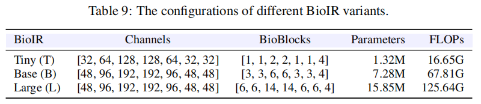
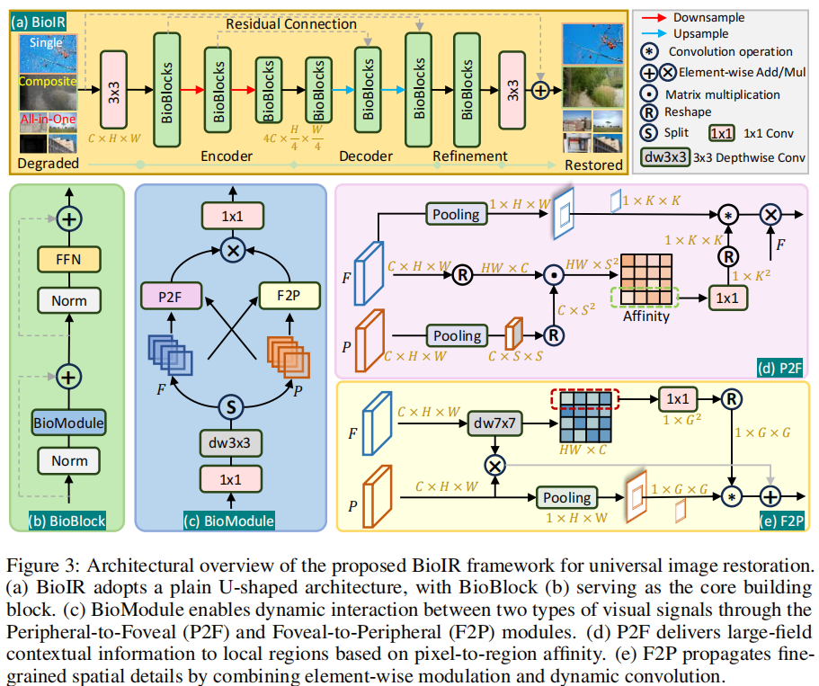

# BioIR原始论文






# 创建环境

创建环境：

```
git clone https://github.com/jaxhur/BioIR-M.git

conda remove -n bioir --all -y
conda create -n bioir python=3.9 -y 
conda activate bioir

# 安装依赖
# conda install pytorch=2.4.0 torchvision pytorch-cuda=12.4 -c pytorch -c nvidia -y
pip install --no-cache-dir torch==2.4.0 torchvision==0.19.0 torchaudio==2.4.0 --index-url https://download.pytorch.org/whl/cu124
pip install opencv-python lmdb tqdm einops scipy scikit-image tensorboard natsort pyiqa joblib lpips ptflops scikit-learn pandas

python -c "import torch; print(torch.__version__, torch.version.cuda, torch.cuda.is_available())"


# 安装basicsr
cd BioIR-M
python -m pip install -e .
# 旧版命令：python setup.py develop --no_cuda_ext
# 验证
python -c "import basicsr; print(basicsr.__file__)"
```


# 数据集

数据集：LOLv1、LOLv2-real、LOLv2-syn

```
pip install -U gdown
apt install -y unzip

cd ./datasets
# LOL-v1
gdown "https://drive.google.com/uc?id=1mAN3ll5wWwt1Xz0C7uio31-NJu-50S8Z"
# LOL-v2
gdown "https://drive.google.com/uc?id=1L0UnJg6gZ4Eb7It2EuNxP0L3lQNmKMaP"

# AUtoDL
cp /root/autodl-fs/LOL-v1.zip /root/BioIR/Single_Composite/datasets
cp /root/autodl-fs/LOL-v2-renamed.zip /root/BioIR/Single_Composite/datasets

# 解压
cd /root/BioIR-M/datasets
unzip LOL-v1.zip -d LOL-v1
unzip LOL-v2-renamed.zip -d LOL-v2

rm LOL-v1.zip LOL-v2-renamed.zip
cd ../
```

目录结构

```
datasets/LOL-v1-Fr/our485/{low,high}
datasets/LOL-v1-Fr/eval15/{low,high}

datasets/LOL-v2-Fr/Synthetic/Train/{Low,Normal}
datasets/LOL-v2-Fr/Synthetic/Test/{Low,Normal}

datasets/LOL-v2-Fr/Real_captured/Train/{Low,Normal}
datasets/LOL-v2-Fr/Real_captured/Test/{Low,Normal}
```


# 训练

## 训练配置

| Dataset     | BatchSize | PatchSize | Actual iterations |
| ----------- | --------: | --------: | ----------------: |
| LOL-v1      |         4 |       256 |           150,000 |
| LOL-v2-syn  |         4 |       256 |           150,000 |
| LOL-v2-real |         4 |       256 |           150,000 |

不同方案应使用不同的 YAML `name`。训练产物和测试产物会按该实验名隔离，便于在同一服务器顺序切换分支训练。

## 训练产物

**周期性输出评价指标、保存模型权重、断点状态**：

```
experiments/<实验名/
  models/
    latest_G.pth
    best_G.pth
    1000_G.pth
  training_state/
    1000.state
  logs/
    train.log
    val.log
  tb_looger/
  visualization/
```


# 测试

## 预训练权重

预训练权重，放到`pretrained_models/`

## 测试产物

`test_lol.py` 是唯一测试入口：同时完成推理、保存增强图、按同名 GT 计算 PSNR/SSIM/LPIPS，统计模型 Params(M) 和输入 `1x3x256x256` 的单次前向复杂度，并写入逐图与汇总指标。

- PSNR/SSIM 固定使用 BasicSR 的 RGB 全图口径（`crop_border=0`）；
- LPIPS 固定使用 AlexNet v0.1，RGB 输入归一化到 `[-1, 1]`。
- Params 按全部生成网络参数除以 `1e6` 统计；
- 复杂度使用 THOP，`GMACs=MACs/1e9`、`GFLOPs=2×MACs/1e9`。

```
# 测试
python test_lol.py --opt options/LOL-v2-syn.yml --weights pretrained_models/LOL-v2-syn.pth
# 额外保存低光图/增强图/GT 的横向拼接对比图
python test_lol.py --opt options/LOL-v2-syn.yml --weights pretrained_models/LOL-v2-syn.pth --save_comparison
```


## 测试产物

```text
test_result/<实验名>/<数据集名>/
  enhanced/              # 增强后图片
  per_image_metrics.csv  # 每张图的 PSNR/SSIM/LPIPS
  metric.csv             # 全测试集平均指标和 Params/GMACs/GFLOPs
```


# LOLv1

训练

```
sh train.sh options/LOL-v1.yml
```

测试

- PSNR：
- SSIM：
- LPIPS：
- 参数量(M)：
- FLOPS(G)：

```
# LOL-v1
python test_lol.py --opt options/LOL-v1.yml --weights experiments/BioIR-LOLv1/models/latest_G.pth
```


# LOLv2-real

训练

```
sh train.sh options/LOL-v2-real.yml
```

测试

- PSNR：
- SSIM：
- LPIPS：
- 参数量(M)：
- FLOPS(G)：

```
# LOL-v2-real
python test_lol.py --opt options/LOL-v2-real.yml --weights experiments/BioIR-LOLv2-real/models/latest_G.pth
```


# LOLv2-syn

训练

```
sh train.sh options/LOL-v2-syn.yml
```

测试

- PSNR：
- SSIM：
- LPIPS：
- 参数量(M)：
- FLOPS(G)：

```
# LOL-v2-syn
python test_lol.py --opt options/LOL-v2-syn.yml --weights experiments/BioIR-LOLv2-syn/models/latest_G.pth
```

