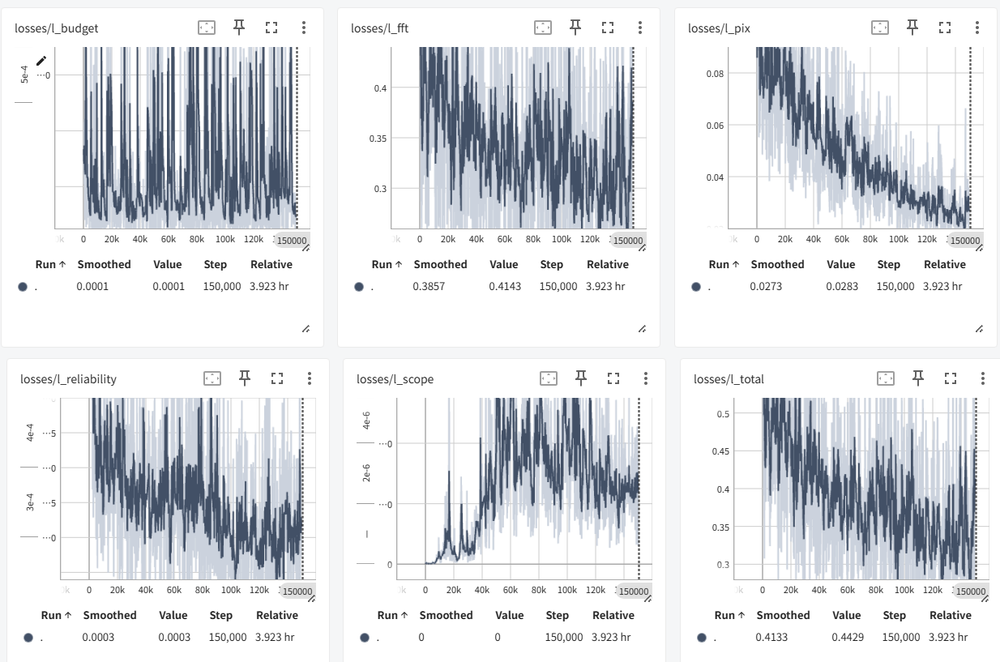
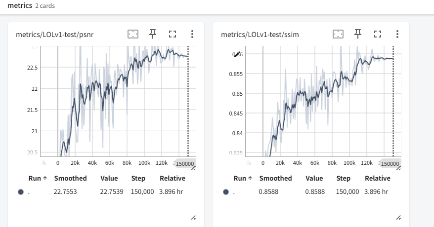

# 创建环境

创建环境：

```
conda init
git clone https://github.com/jaxhur/BioIR-M.git

cd BioIR-M
git switch codex/bear-bioir

conda create -n bear-bioir python=3.10 -y --override-channels -c https://repo.anaconda.com/pkgs/main
conda activate bear-bioir

# 安装依赖
pip install --no-cache-dir torch torchvision torchaudio --index-url https://download.pytorch.org/whl/cu128
pip install torch torchvision torchaudio --index-url https://download.pytorch.org/whl/cu128

pip install opencv-python lmdb tqdm einops scipy scikit-image tensorboard natsort pyiqa joblib lpips ptflops scikit-learn pandas thop
pip install -i https://pypi.tuna.tsinghua.edu.cn/simple opencv-python lmdb tqdm einops scipy scikit-image tensorboard natsort pyiqa joblib lpips ptflops scikit-learn pandas thop


python -c "import torch; print(torch.__version__, torch.version.cuda, torch.cuda.is_available())"


# 安装basicsr
python -m pip install -e .
# 旧版命令：python setup.py develop --no_cuda_ext
# 验证
python -c "import basicsr; print(basicsr.__file__)"
```


# 数据集

数据集：LOLv1、LOLv2-real、LOLv2-syn

```
pip install -U gdown
apt install -y unzip

cd ./datasets
# LOL-v1
gdown "https://drive.google.com/uc?id=1mAN3ll5wWwt1Xz0C7uio31-NJu-50S8Z"
# LOL-v2
gdown "https://drive.google.com/uc?id=1L0UnJg6gZ4Eb7It2EuNxP0L3lQNmKMaP"


# 解压
unzip LOL-v1.zip -d LOL-v1
unzip LOL-v2-renamed.zip -d LOL-v2

rm LOL-v1.zip LOL-v2-renamed.zip
cd ../
```


```
#hyperai
cp /openbayes/input/input0/LOL-v1.zip /openbayes/input/input0/LOL-v2-renamed.zip /openbayes/home/BioIR-M/datasets

# AUtoDL
cp /root/autodl-fs/LOL-v1.zip /root/BioIR/Single_Composite/datasets
cp /root/autodl-fs/LOL-v2-renamed.zip /root/BioIR/Single_Composite/datasets
```

目录结构

```
datasets/LOL-v1-Fr/our485/{low,high}
datasets/LOL-v1-Fr/eval15/{low,high}

datasets/LOL-v2-Fr/Synthetic/Train/{Low,Normal}
datasets/LOL-v2-Fr/Synthetic/Test/{Low,Normal}

datasets/LOL-v2-Fr/Real_captured/Train/{Low,Normal}
datasets/LOL-v2-Fr/Real_captured/Test/{Low,Normal}
```


# 训练

## 训练配置

| Dataset     | BatchSize | PatchSize | Actual iterations |
| ----------- | --------: | --------: | ----------------: |
| LOL-v1      |         4 |       256 |           150,000 |
| LOL-v2-syn  |         4 |       256 |           150,000 |
| LOL-v2-real |         4 |       256 |           150,000 |


## Tensorboard

```
tensorboard --logdir ./BioIR-M/experiments/BioIR-LOLv1/tb_looger --port 6008
```


## 训练产物

**周期性输出评价指标、保存模型权重、断点状态**：

```
experiments/<实验名/
  models/
    latest_G.pth
    best_G.pth
    1000_G.pth
  training_state/
    1000.state
  logs/
    train.log
    val.log
  tb_looger/
  visualization/
```


# 测试

## 预训练权重

预训练权重，放到`pretrained_models/`

## 测试产物

`test_lol.py` 是唯一测试入口：同时完成推理、保存增强图、按同名 GT 计算 PSNR/SSIM/LPIPS，统计模型 Params(M) 和输入 `1x3x256x256` 的单次前向复杂度，并写入逐图与汇总指标。

- PSNR/SSIM 固定使用 BasicSR 的 RGB 全图口径（`crop_border=0`）；
- LPIPS 固定使用 AlexNet v0.1，RGB 输入归一化到 `[-1, 1]`。
- Params 按全部生成网络参数除以 `1e6` 统计；
- 复杂度使用 THOP，`GMACs=MACs/1e9`、`GFLOPs=2×MACs/1e9`。

```
# 测试
python test_lol.py --opt options/LOL-v2-syn.yml --weights pretrained_models/LOL-v2-syn.pth
# 额外保存低光图/增强图/GT 的横向拼接对比图
python test_lol.py --opt options/LOL-v2-syn.yml --weights pretrained_models/LOL-v2-syn.pth --save_comparison
```

## 路由行为可视化（无需重新训练）

默认读取 YAML 中的 `datasets.val.dataroot_lq`，对完整测试集逐图执行一次前向，
直接复用训练完成的 BEAR-BioIR 权重：

```bash
python visualize_bear_routing.py \
  --opt options/BEAR-LOLv1.yml \
  --weights experiments/BEAR-BioIR-v2-LOLv1/models/best_G.pth
```

默认输出到
`analysis_artifacts/routing_behavior/<实验名>/<图片相对路径>/`，每张图包含
低光输入、最终增强结果、`A_1/A_2/A_3` 范围图、`R_1/R_2/R_3` 可靠性图、
预测结构图 `S_hat`、3×3 总览图、原始 `.npz` 数组、统计 CSV 和复现实验
元数据。实验根目录另存 `routing_dataset_statistics.csv`，汇总整个测试集每张
图的预算及各路由图均值、标准差。

如只需重跑一张代表图，可额外传入：

```bash
--image datasets/LOL-v1/eval15/low/1.png
```

`A/R/S_hat` 均按统一的 `[0,1]` 标尺保存，不进行逐图 min-max 拉伸；区域级
`A/R` 使用最近邻展开到输入尺寸，避免可视化插值制造模型并未预测的平滑边界。


## 测试产物

```text
test_result/<实验名>/<数据集名>/
  enhanced/              # 增强后图片
  per_image_metrics.csv  # 每张图的 PSNR/SSIM/LPIPS
  metric.csv             # 全测试集平均指标和 Params/GMACs/GFLOPs
```


# LOLv1

```
CUDA_VISIBLE_DEVICES=0 sh train.sh options/BEAR-LOLv1.yml ; \
CUDA_VISIBLE_DEVICES=0 sh train.sh options/BEAR-LOLv2-real.yml ; \
CUDA_VISIBLE_DEVICES=0 sh train.sh options/BEAR-LOLv2-syn.yml
```

train_all.sh

```
#!/bin/bash

set -e

export CUDA_VISIBLE_DEVICES=0

echo "===== Training LOLv1 ====="
sh train.sh options/BEAR-LOLv1.yml

echo "===== Training LOLv2-real ====="
sh train.sh options/BEAR-LOLv2-real.yml

echo "===== Training LOLv2-syn ====="
sh train.sh options/BEAR-LOLv2-syn.yml

echo "===== All training finished ====="
```

训练

```
CUDA_VISIBLE_DEVICES=0 sh train.sh options/BEAR-LOLv1.yml
```

```
# 查看当前错误链接
ls -ld ./tf_dir
readlink ./tf_dir

# 只删除软连接
unlink ./tf_dir

# 重新建立正确链接
ln -s "./BioIR-M/experiments/BEAR-BioIR-v2-LOLv1/tb_looger" "./tf_dir"
ln -s "./BioIR-M/experiments/BEAR-BioIR-v2-LOLv2-real/tb_looger" "./tf_dir"
/openbayes/home/BioIR-M/experiments/BEAR-BioIR-v2-LOLv2-real/training_state
# 验证最终指向
readlink -f ./tf_dir
ls ./tf_dir
```

测试

- psnr=22.3775, rgb_ssim=0.8508, lpips=0.1194] [complexity: params_m=1.8090, gmacs_g=17.1660, gflops_g=34.3320]

```
python test_lol.py --opt options/BEAR-LOLv1.yml --weights ./experiments/BEAR-BioIR-LOLv1/models/best_G.pth

python test_lol.py --opt options/BEAR-LOLv1.yml --weights ./experiments/BEAR-BioIR-v2-LOLv1/models/best_G.pth
python test_lol.py --opt options/BEAR-LOLv1.yml --weights ./experiments/BEAR-BioIR-v2-LOLv1-B/models/best_G.pth
python test_lol.py --opt options/BEAR-LOLv1.yml --weights ./experiments/BEAR-BioIR-v2-LOLv1-C/models/best_G.pth
python test_lol.py --opt options/BEAR-LOLv1.yml --weights ./experiments/BEAR-BioIR-v2-LOLv1-D/models/best_G.pth
```





# LOLv2-real

训练

```
CUDA_VISIBLE_DEVICES=0 sh train.sh options/BEAR-LOLv2-real.yml
```

```
# 查看当前错误链接
ls -ld ./tf_dir
readlink ./tf_dir

# 只删除软连接
unlink ./tf_dir

# 重新建立正确链接
ln -s "./BioIR-M/experiments/BEAR-BioIR-LOLv2-real/tb_looger" "./tf_dir"


# 验证最终指向
readlink -f ./tf_dir
ls ./tf_dir
```

测试

```
python test_lol.py --opt options/BEAR-LOLv2-real.yml --weights experiments/BEAR-BioIR-v2-LOLv2-real/models/best_G.pth

python test_lol.py --opt options/BEAR-LOLv2-real.yml --weights experiments/BEAR-BioIR-v2-LOLv2-real-B/models/best_G.pth
python test_lol.py --opt options/BEAR-LOLv2-real.yml --weights experiments/BEAR-BioIR-v2-LOLv2-real-C/models/best_G.pth
python test_lol.py --opt options/BEAR-LOLv2-real.yml --weights experiments/BEAR-BioIR-v2-LOLv2-real-D/models/best_G.pth
```


# LOLv2-syn

训练

```
CUDA_VISIBLE_DEVICES=0 sh train.sh options/BEAR-LOLv2-syn.yml
```

测试

```
python test_lol.py --opt options/BEAR-LOLv2-syn.yml --weights experiments/BEAR-BioIR-v2-LOLv2-syn/models/best_G.pth

python test_lol.py --opt options/BEAR-LOLv2-syn.yml --weights experiments/BEAR-BioIR-v2-LOLv2-syn-B/models/best_G.pth
python test_lol.py --opt options/BEAR-LOLv2-syn.yml --weights experiments/BEAR-BioIR-v2-LOLv2-syn-C/models/best_G.pth
python test_lol.py --opt options/BEAR-LOLv2-syn.yml --weights experiments/BEAR-BioIR-v2-LOLv2-syn-D/models/best_G.pth
```


# 可视化\(A_s\)、\(R_s\)、\(\widehat S_l\) 


```
# 单图
python visualize_bear_routing.py --opt options/BEAR-LOLv1.yml --weights 1best_G.pth --image datasets/LOL-v1/eval15/low/1.png

# 整个测试集
python visualize_bear_routing.py --opt options/BEAR-LOLv1.yml --weights 1best_G.pth --input-dir datasets/LOL-v1/eval15/low

python visualize_bear_routing.py --opt options/BEAR-LOLv2-real.yml --weights 2best_G.pth --input-dir datasets/LOL-v2/Real_captured/Test/Low

python visualize_bear_routing.py --opt options/BEAR-LOLv2-syn.yml --weights 22best_G.pth --input-dir datasets/LOL-v2/Synthetic/Test/Low
```

默认产物目录：

```
analysis_artifacts/routing_behavior/<实验名>/<图片名>/
├── input_low.png
├── enhanced.png
├── A_1.png
├── A_2.png
├── A_3.png
├── R_1.png
├── R_2.png
├── R_3.png
├── S_hat.png
├── heatmaps/
├── routing_overview.png
├── routing_arrays.npz
├── routing_statistics.csv
└── metadata.json
```

